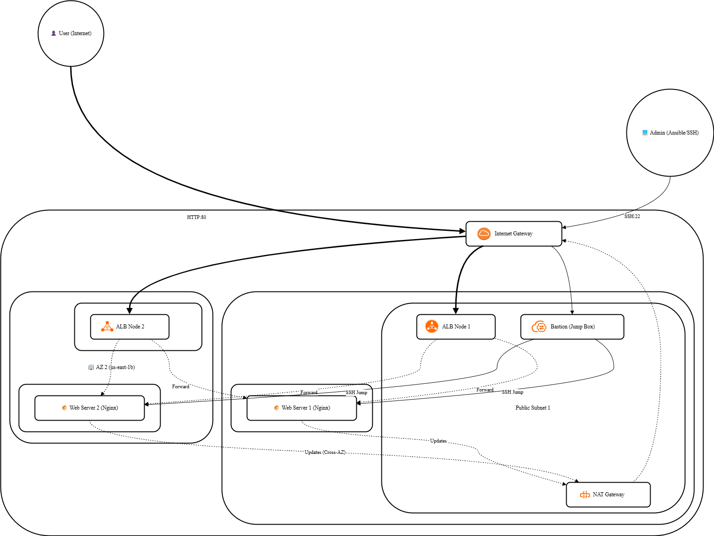

# 3-Tier AWS Architecture with Ansible

### Project Overview
This project demonstrates the design and automated deployment of a secure, highly available web architecture on AWS. The environment strictly isolates application servers in private subnets, utilizing a Bastion Host for secure administrative access and an Application Load Balancer (ALB) to distribute public traffic. Configuration management is fully automated using Ansible.

### 🛠️ Technology Stack
* **Cloud Provider:** AWS (VPC, EC2, ALB, NAT Gateway, Security Groups)
* **Configuration Management:** Ansible
* **Operating System:** Ubuntu Linux
* **Web Server:** Nginx

### 🏗️ Architecture Highlights
1. **Network Isolation:** Custom VPC with Public and Private Subnets across two Availability Zones for High Availability.
2. **Secure Access:** A Bastion Host (Jump Box) acts as the single point of entry for SSH access. Private instances have no public IPs.
3. **Automated Provisioning:** Ansible playbooks configure the web servers. 
4. **SSH Agent Forwarding:** Utilized `ssh-agent` to allow Ansible to securely configure private nodes through the Bastion Host without copying private keys to the public subnet.
5. **Load Balancing:** An Internet-facing ALB distributes HTTP traffic across the private Nginx nodes.

### ⚙️ Files Included
* `site.yml`: The main Ansible playbook that installs and configures Nginx.
* `hosts.ini`: The inventory file configured to route Ansible traffic through the Bastion Host using `ProxyCommand`.

### 🚀 Challenges Overcome
* **Secure Automation:** Solved connection timeouts during Ansible deployment by implementing SSH Agent Forwarding, allowing local execution to bridge through the Bastion host seamlessly.
* **Traffic Routing:** Correctly configured Security Group chaining to allow the ALB to perform health checks on private instances while blocking all other inbound internet traffic.
